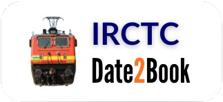
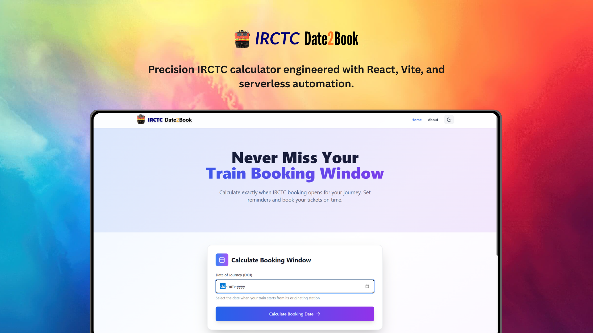
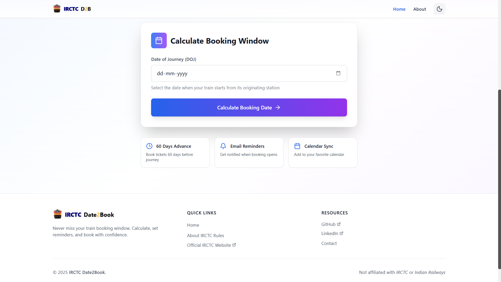
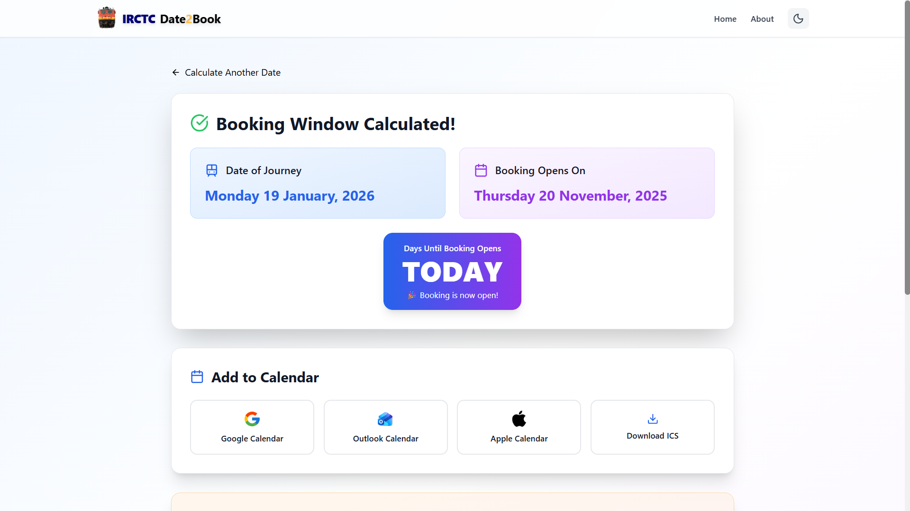
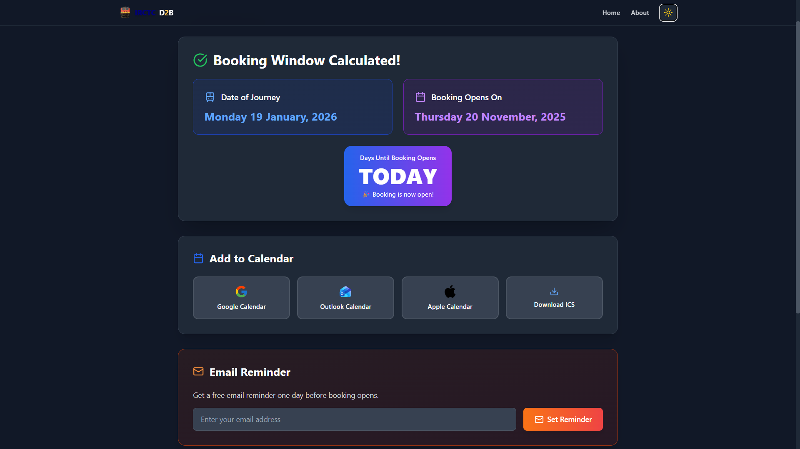
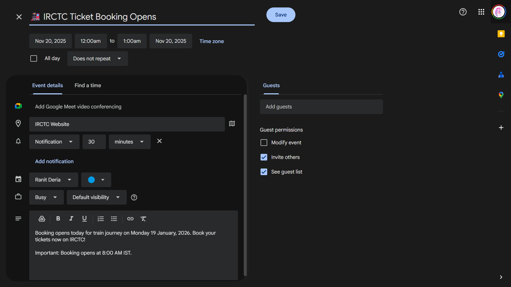
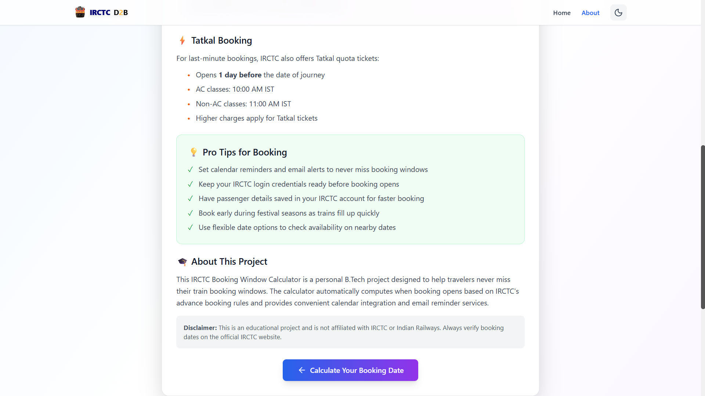

<div align="center">


[](https://twitter.com/intent/follow?screen_name=DeriaRanit)
[](https://www.linkedin.com/in/ranit-deria-916864257/)

  <br />
  <br />

  <p align="center">
    
  </p>

  <h2 align="center">Date2Book - IRCTC Booking Window Calculator</h2>

  <p>
    Date2Book is an intelligent web application that helps Indian railway passengers never miss their train ticket booking windows. Built with React and Vite, it automatically calculates when IRCTC booking opens (60 days in advance) and provides seamless calendar integration and email reminders via Resend, ensuring you book your tickets on time, every time.
  </p>

  <a href="https://date2book.vercel.app/"><strong>➥ Live Demo</strong></a>

  <br />

  

</div>

<br />

<div align="center">
  
  
  
  
  
</div>

## Table of Contents

- [Prerequisites](#prerequisites)
- [Technologies Utilized](#technologies-utilized)
- [Features](#features)
- [Run Locally](#run-locally)
- [Deployment](#deployment)
- [Configuration](#configuration)
- [Project Structure](#project-structure)
- [How It Works](#how-it-works)
- [Sample Calculation](#sample-calculation)
- [License](#license)
- [Contact](#contact)

### Prerequisites: <a name="prerequisites"></a>

Before setting up Date2Book, ensure you have the following installed and configured:

- **[Node.js](https://nodejs.org/)** (v18.x or later)
- **[npm](https://www.npmjs.com/)** or **[pnpm](https://pnpm.io/)** (package manager)
- **[Git](https://git-scm.com/)** (for version control)
- **[Resend Account](https://resend.com/)** (for email reminder functionality)

### Technologies and Services Utilized: <a name="technologies-utilized"></a>

- **Build Tool:**  Vite 5
- **UI Library:**  React 18
- **Programming Language:**  JavaScript (ES6+)
- **Styling:**  Tailwind CSS 3
- **State Management:**  Zustand
- **Icons:**  Lucide React
- **Email Service:**  Resend

### Features: <a name="features"></a>

- **📅 Accurate Booking Calculation:** Automatically calculates booking open date 60 days before journey date (excluding DOJ).
- **🌓 Dark/Light Mode:** Beautiful Maybach-inspired themes with smooth transitions.
- **📧 Email Reminders:** Get notified 24 hours before booking opens via **Resend** integration.
- **🗓 Calendar Integration:** Seamlessly add reminders to your preferred calendar application (Google/Apple/Outlook).
- **📱 Responsive Design:** Fully optimized for mobile, tablet, and desktop devices.
- **⚡ Instant Results:** Real-time calculation without page reloads.

### Run Locally: <a name="run-locally"></a>

To run **Date2Book** on your local machine, follow the steps below:

1. **Clone the Repository:**

   ```bash
   git clone https://github.com/RanitDERIA/irctc-date2book.git
   ```

2. **Install Dependencies:**

   ```
   npm install
   ```

   or

   ```
   pnpm install
   ```

3. **Environment Setup:** Create a `.env` file in the root directory and add your Resend configuration:

   ```
   # Resend API Configuration
   VITE_RESEND_API_KEY="re_your_api_key_here"
   ```

4. **Start the Development Server:**

   ```
   npm run dev
   ```

5. **Open Your Browser:** Navigate to http://localhost:5173 to see the application running.

### Deployment: <a name="deployment"></a>

The application is optimized for deployment on **Vercel**, but can be deployed to any platform that supports Node.js.

**Deploy to Vercel:**

1.  Push your code to a GitHub repository.
2.  Connect your repository to Vercel.
3.  Configure the `VITE_RESEND_API_KEY` environment variable in the Vercel project dashboard.
4.  Deploy! Vercel will automatically build and deploy your application.

### Project Structure: <a name="project-structure"></a>

```
irctc-date2book/
├── api/                        # Serverless / API functions
│   └── sendReminder.js
├── public/                     # Static assets (manifests, favicons)
├── README-images/              # Images used in documentation
├── src/                        # Source code
│   ├── assets/                 # Images and icons
│   ├── components/             # Reusable React components
│   │   ├── layout/             # Header, Footer, Layout wrappers
│   │   │   ├── Footer.jsx
│   │   │   └── Navbar.jsx
│   │   ├── sections/           # Page sections / feature components
│   │   │   ├── CalculatorCard.jsx
│   │   │   ├── CalendarIntegration.jsx
│   │   │   ├── EmailReminder.jsx
│   │   │   ├── HeroSection.jsx
│   │   │   └── ResultDisplay.jsx
│   │   └── ui/                 # Base UI elements (Buttons, Cards)
│   │       ├── CalendarButton.jsx
│   │       ├── InfoCard.jsx
│   │       └── ThemeToggle.jsx
│   ├── pages/                  # Top-level route pages
│   │   ├── AboutPage.jsx
│   │   ├── HomePage.jsx
│   │   └── ResultPage.jsx
│   ├── store/                  # Zustand state store
│   │   └── useStore.js
│   ├── styles/                 # Global styles & animations
│   │   ├── animations.css
│   │   └── index.css
│   ├── utils/                  # Utilities & helper functions
│   │   ├── calendarLinks.js
│   │   ├── dateCalculations.js # Core calculation logic
│   │   └── icsGenerator.js
│   ├── App.jsx                 # Main application component
│   └── main.jsx                # Application entry point
├── index.html                  # HTML entry point
├── tailwind.config.js          # Tailwind CSS configuration
├── vite.config.js              # Vite configuration
├── postcss.config.js           # PostCSS configuration
├── vercel.json                 # Vercel deployment config
└── package.json                # Dependencies and scripts
```

### How It Works: <a name="how-it-works"></a>
1.  **Select Journey Date:** User inputs their planned date of travel.
2.  **Calculation:** The app subtracts ``60 days`` from the journey date (standard IRCTC advance reservation period).
3.  **Display:** Shows the exact date and time (usually ``8:00 AM IST``) when booking opens.
4.  **Action:** User can set a Google Calendar reminder or request an email notification via ``Resend``.

### Sample Calculation: <a name="sample-calculation"></a>

**Scenario:** You want to travel on December 25th.

**Input (Journey Date):** 25th December

**Algorithm:** 25 Dec − 60 days

**Result:** 26th October @ 8:00 AM IST

### License: <a name="license"></a>

This project is licensed under the **MIT License** - see the [LICENSE](LICENSE) file for details.

### Contact: <a name="contact"></a>

If you want to get in touch or have any questions regarding this project, feel free to reach out:

📧 **Email:** bytebardderia@gmail.com
💼 **LinkedIn:** [Ranit Deria](https://www.linkedin.com/in/ranit-deria-916864257/)

🐦 **Twitter:** [@DeriaRanit](https://twitter.com/DeriaRanit)
💻 **GitHub:** [@RanitDERIA](https://github.com/RanitDERIA)

For any inquiries, suggestions, or bug reports, you can also:

- 🐛 Open an issue on GitHub
- 💬 Start a discussion in the repository
- 📩 Send a direct message via social media

---

<div align="center">
  
**⭐ Star this repository if you find it helpful!**

Made with ❤️ by [Ranit Deria](https://github.com/RanitDERIA)